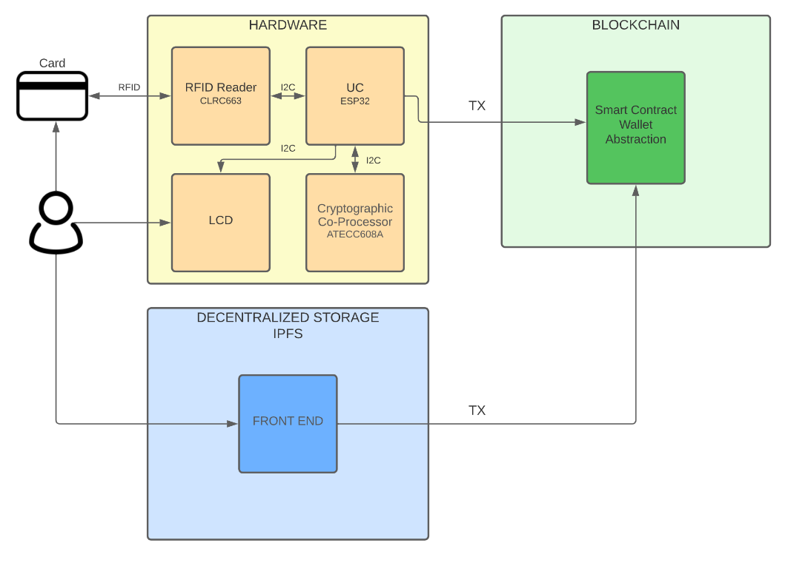
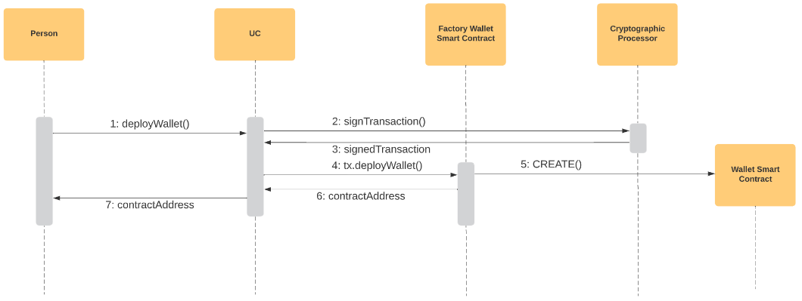
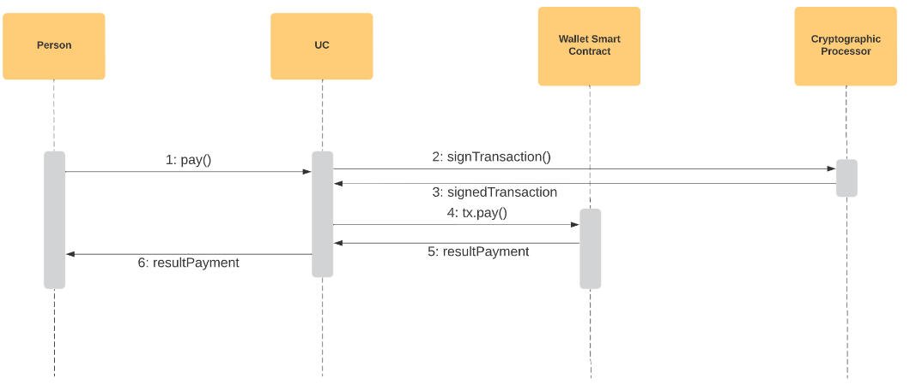

# RFID-wallet
RFID Card based EVM wallet abstraction

**Member teams:** Josep Chetrit and Giannfranco Bazzani.

In this project we are going to give our first idea about an rfid card as a wallet. Our goal is to design specific hardware to be able to make micropayments in smart cities.

## The main hardware components:

- RFID reader.
- Microcontroller.
- Crypto processor.

	

## Process of how to deploy a smart contract wallet:

The first time the authorized card connects with the hardware, the hardware must send a transaction to the smart contract factory wallet, this smart contract is a wallet factory, it will implement a new smart contract for the card owner, this contract will be the wallet for this user.

The user's wallet will contain the hash of the password, username, methods (to pay, recover the password, etc).

The factory wallet has to have a mapping to control all implemented wallets and who owns them.

	

## Process how to make a payment:

**Warning:** The wallet needs to have funds (We can use tokenomics to pay).

The user needs to connect his card with the hardware, enter the password, the hardware will generate a hash of this password and send it as a transaction to the user's smart contract wallet, if the hash is the same as the one stored in the wallet. smart contract, the wallet can make the payment (if the wallet has sufficient funds).

	

## Process how the hardware can send transactions:

The hardware has a specific xip to control the private key/public key, the private key is stored very securely, and no one can access to read the private key. The microcontroller, when it needs to send a transaction, it provides the data to this specific xip, and the xip returns the signed data, and the microcontroller can send this signed data to the blockchain node.
